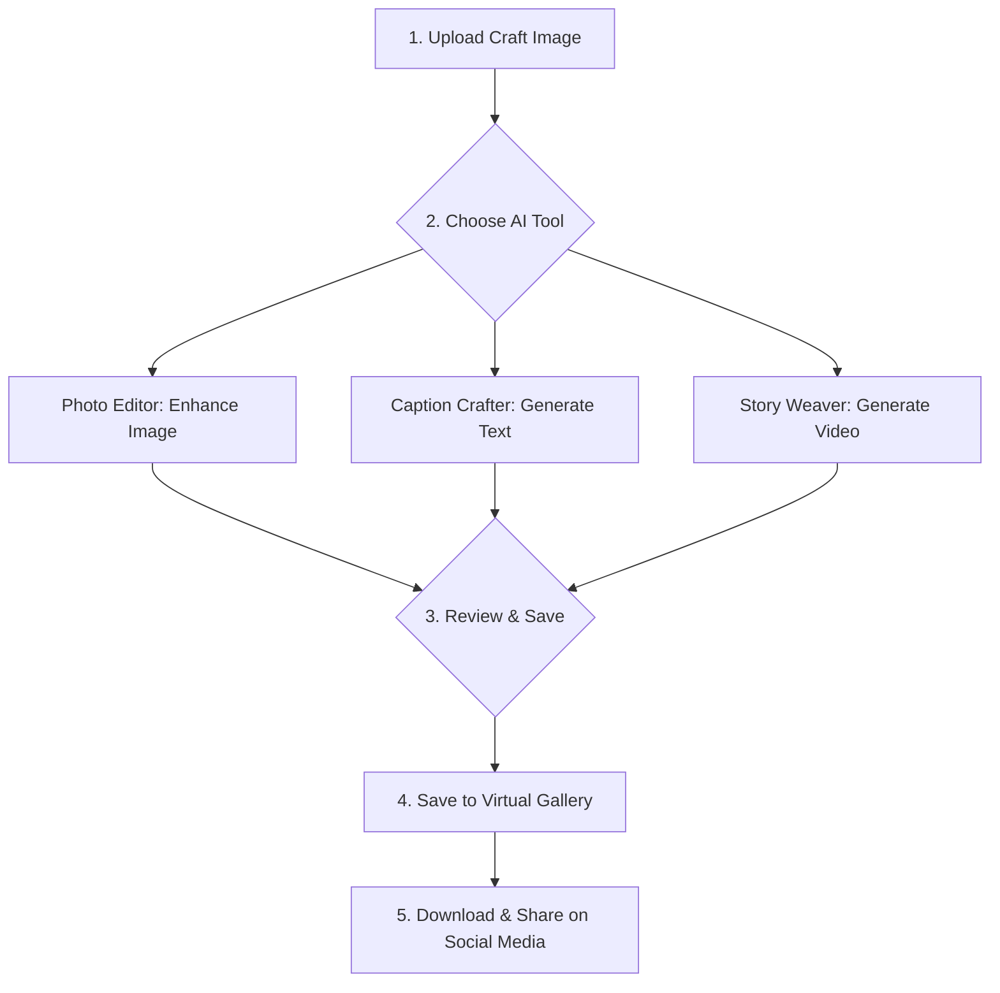

# Prototype Presentation: KalaKarvan - The Artisan's AI Co-pilot

## 1. Brief About the Prototype

**KalaKarvan** is an AI-powered digital co-pilot designed to empower local Indian artisans in the modern marketplace. Its core purpose is to bridge the digital divide by providing an intuitive, all-in-one platform with intelligent tools for content creation, media editing, and digital marketing. By simplifying complex digital tasks, KalaKarvan enables artisans to effectively showcase their craft, tell their unique stories, and connect with a global audience online, ensuring the preservation and promotion of timeless art forms.

---

## 2. Opportunity

### How is this solution different?
Unlike generic content creation tools or complex e-commerce platforms that require significant technical expertise, KalaKarvan is purpose-built for the artisan. It combines culturally-aware AI with a user-friendly interface, removing the friction typically associated with digital marketing.

### How does it solve the core problem?
KalaKarvan directly addresses the primary challenges faced by local artisans:
- **Limited Digital Literacy:** It offers simple, guided workflows that don't require a background in marketing or technology.
- **Lack of Professional Tools:** The AI Photo Editor and Story Weaver substitute the need for expensive photography equipment and video editing software.
- **Difficulty Reaching Audiences:** The AI Digital Guru and Caption Crafter provide the strategic knowledge needed to engage customers and build an online brand.

### Unique Selling Proposition (USP)
KalaKarvan's power lies in its integrated, AI-driven toolkit, all available within a single, cohesive platform:
- **AI Digital Guru:** A personal marketing mentor on demand.
- **Caption Crafter:** Instant, engaging social media content.
- **Story Weaver:** Automated video creation to share the artistic journey.
- **Photo Editor:** Professional-grade image enhancement with simple text prompts.
- **Virtual Gallery:** A centralized hub to store, organize, and deploy all digital assets.

---

## 3. List of Features Offered

- **🧠 AI Digital Guru:** A conversational chatbot-style mentor that provides expert guidance on digital marketing, social media strategy, and branding.
- **✍️ Caption Crafter:** Instantly generates multiple trendy, culturally relevant, and engaging captions with appropriate hashtags for social media posts.
- **🎥 Story Weaver:** Crafts creative and informative video stories about an artisan's craft, process, and inspiration from a simple text prompt.
- **🎨 Photo Editor:** Enhances images of crafts to make them more appealing to the target audience, with features like background changes, framing, and lighting adjustments.
- **🖼️ Virtual Gallery:** A personal workspace to store, organize, and manage all AI-generated creations (captions, images, videos) for easy access and sharing on platforms like Instagram and YouTube.

---

## 4. Process Flow / Use-Case Diagram

This diagram illustrates a typical journey for an artisan using the KalaKarvan application.



---

## 5. Wireframes / Mockups (Conceptual)

- **Dashboard Screen:** A welcoming home screen with a grid of beautifully designed cards. Each card represents a core feature (e.g., "Caption Crafter," "Photo Editor"), displaying an icon and a short description. A persistent navigation bar provides access to the Dashboard, Virtual Gallery, and Profile.
- **Photo Editor Screen:** A clean, two-panel layout. The left panel prominently displays the uploaded artisan's craft. The right panel contains a simple text input field ("Describe the changes you want...") and a "Generate" button. The AI-edited image appears below, with clear "Save to Gallery" and "Download" buttons.
- **Gallery Screen:** A visually appealing masonry grid showcasing all saved creations. Each item is a card with a preview (image, video thumbnail, or text snippet). Hovering over a card reveals options to "Copy Text," "Download," or "Delete."

---

## 6. Architecture Diagram

The system is designed with a modern, scalable serverless architecture that leverages the power of cloud-based AI models.

```mermaid
graph TD
    subgraph "User Layer"
        Frontend[Web/Mobile UI<br>(React / Vue.js)]
    end

    subgraph "Backend Services"
        APIServer[Backend Server<br>(Python - FastAPI / Flask)]
        DB[(Database<br>Firebase / MongoDB)]
        Storage[File Storage<br>(Google Cloud Storage)]
    end

    subgraph "AI Core (Google Cloud)"
        Gemini[Gemini Models<br>(NLP, Vision, Video)]
    end
    
    subgraph "External Integrations"
        SocialAPIs[Social Media APIs<br>(Instagram, YouTube)]
    end

    Frontend -- API Calls --> APIServer;
    APIServer -- Stores/Retrieves Data --> DB;
    APIServer -- Manages Files --> Storage;
    APIServer -- AI Requests --> Gemini;
    APIServer -- Pushes Content --> SocialAPIs;
```
---

## 7. Technologies to Be Used

- **Frontend:** `Vue.js` / `React Native` (for mobile), `HTML/CSS/JS`
- **Backend:** `Python (FastAPI / Flask)`, `Node.js` (optional)
- **AI Models:** `Gemini` (for digital guru, caption crafter, story weaver), `OpenCV/Pillow` (for basic photo editing)
- **Database:** `Firebase` / `MongoDB` / `PostgreSQL`
- **Cloud & Hosting:** `Google Cloud Platform` (for storage, AI integration), `Firebase Hosting`
- **Integration:** `Instagram API`, `YouTube API` (for direct content upload)
